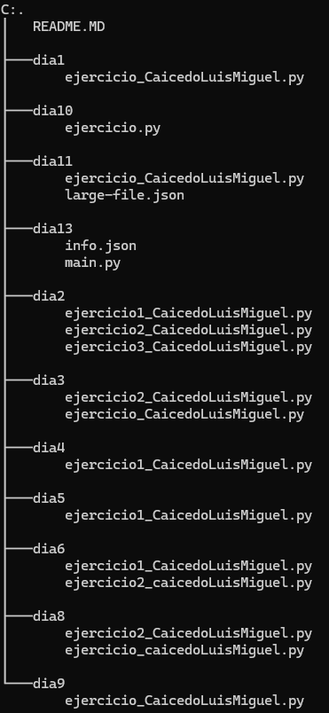

# Trabajos de Python
## descripción
En este repositorio se encuentra una serie de carpetas las cuales tienen trabajos que fueron realizados diariamente

## Estructura

## Carpetas

- **dia1:** 
    |Nombre|descripción|
    |--|--|
    |ejercicio_CaicedoLuisMiguel.py|Es un programa para demostrar los datos primitivos.|

- **dia2:**
    |Nombre|descripción|
    |--|--|
    |ejercicio1_CaicedoLuisMiguel.Py|Es un programa que permite al usuario ver la serie Fibonacci.|
    |ejercicio2_CaicedoLuisMiguel.Py|Es un programa de un juego que genera un numero aleatorio y el usuario tiene que adivinarlo y le dice en cuantos intentos lo adivinó.
    |ejercicio3_CaicedoLuisMiguel.Py|Es un programa de un juego que genera un numero aleatorio y el usuario tiene que adivinarlo en 10 intentos o menos.

- **dia3:**
    |Nombre|descripción|
    |--|--|
    |ejercicio_CaicedoLuisMiguel.Py|Este es un programa que permite al usuario ingresar un numero y le dice si el numero es primo o no.|
    |ejercicio2_CaicedoLuisMiguel.Py|Programa que genera para el usuario una contraseña segura.|
- **dia4:**
    |Nombre|descripción|
    |--|--|
    |ejercicio1_CaicedoLuisMiguel.Py|programa que ayuda para el cambio de monedas.
- **dia5:**
    |Nombre|descripción|
    |--|--|
    |ejercicio1_CaicedoLuisMiguel.Py|Este archivo no contiene nada.
- **dia6:**
    |Nombre|descripción|
    |--|--|
    |ejercicio1_CaicedoLuisMiguel.Py|Programa que pide al usuario una lista de números, luego le muestra la lista de manera ordenada y sin números repetidos.|
    |ejercicio2_caicedoLuisMiguel.Py|Este programa pide una lista y un numero entonces el programa buscará dos números que sumados den como resultado el numero pedido y que imprima en que índice se encuentran
- **dia8:**
    |Nombre|descripción|
    |--|--|
    |ejercicio_caicedoLuisMiguel.py|Este programa podrán comprar subscripciones a un periódico y también regalarlas|
    |ejercicio2_CaicedoLuisMiguel.Py|Este programa solo imprime una lista.|
- **dia9:**
    |Nombre|descripción|
    |--|--|
    |ejercicio_CaicedoLuisMiguel.py|Este programa permite una venta de frutas
- **dia10:**
    |Nombre|descripción|
    |--|--|
    |ejercicio.py|Este programa pide una lista y luego le pide un numero y verifica si se encuentra el la lista e imprime la posición en la que se encuentra
- **dia11:**
    |Nombre|descripción|
    |--|--|
    |ejercicio_CaicedoLuisMiguel.py|Este es un programa permite mostrar, eliminar, crear y modificar el archivo *large-file.json*|
    |large-file.json|Es un archivo que contiene que información de unos eventos de Git Hub

- **dia13:**
    |Nombre|descripción|
    |--|--|
    |main.py|Es un programa que administra una escuela y puede agregar eliminar modificar y ver los estudiantes que están inscritos.|
    |info.json|Este es el archivo que contiene todos los datos de los estudiantes.|

## tecnologías utilizadas
|PYTHON|JSON|
|--|--|
|||
## Contacto
E-mail: luismiguel110205@gmail.com
## Autor
- **Luis Miguel Caicedo Bermon**